# The Quarkus Native AI Agent Ecosystem
### CaseHub · Claudony · Qhorus

> *A composable, observable, human-participable platform for coordinated AI agent systems — built on Quarkus Native.*

---

## The Problem

The era of single-agent AI is ending.

The interesting work — the commercially valuable work — is increasingly multi-agent: a planner delegates to a researcher, who hands off to a coder, who requests review, who escalates to a human when uncertain. These systems are being built today, but they are built **artisanally**: ad-hoc communication, no shared memory, no observability, no learning from what worked. Each team reinvents the wiring.

What's missing is **infrastructure** — the same kind of infrastructure that made distributed systems tractable: message brokers, service registries, orchestration frameworks, observability layers. But designed from the ground up for AI agents, not microservices.

This document describes that infrastructure: three composable Quarkus Native components that each solve a real problem independently, and produce something qualitatively new when combined.

---

## The Ecosystem at a Glance

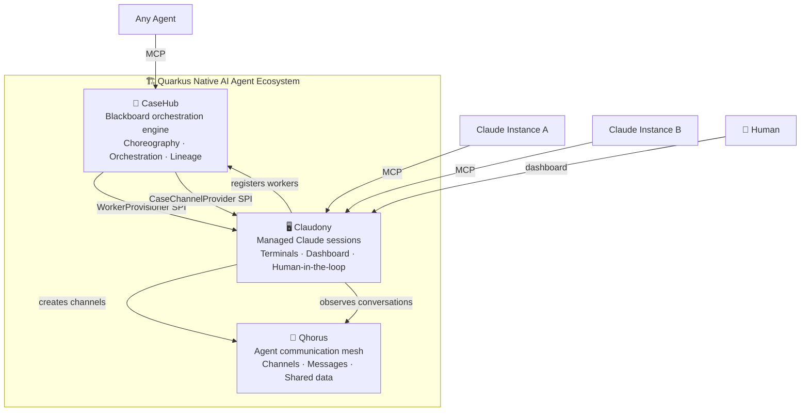

Each component is independently useful. Together they form a platform that doesn't exist elsewhere: **a fully observable, learning, human-participable multi-agent AI system on a single native binary**.

---

## Component Overview

| | **CaseHub** | **Qhorus** | **Claudony** |
|---|---|---|---|
| **Role** | Reasoning & coordination engine | Agent communication mesh | Session management & integration layer |
| **Analogy** | The brain | The nervous system | The body |
| **Standalone value** | Orchestrate any AI workload | Route messages between any agents | Manage Claude terminal sessions |
| **Combined value** | Knows *what* agents should do | Knows *what* agents are saying | Knows *where* agents are running |
| **Data it owns** | CaseFiles, tasks, lineage, goals | Channels, messages, shared data | Sessions, terminals, credentials |
| **MCP surface** | `casehub-mcp` module | Native MCP server | Agent MCP endpoint |

---

## CaseHub — The Coordination Engine

CaseHub implements the **Blackboard Architecture** (Hayes-Roth, 1985) using CMMN terminology — a shared workspace where specialist workers self-organise around a problem. It has two execution models that can work in concert.

### Choreography — Workers That Self-Organise

In choreography, no one is in charge. Each worker declares what it can contribute and what it needs to begin. The CaseEngine evaluates which workers are ready and lets them run. Order emerges from dependency, not direction.

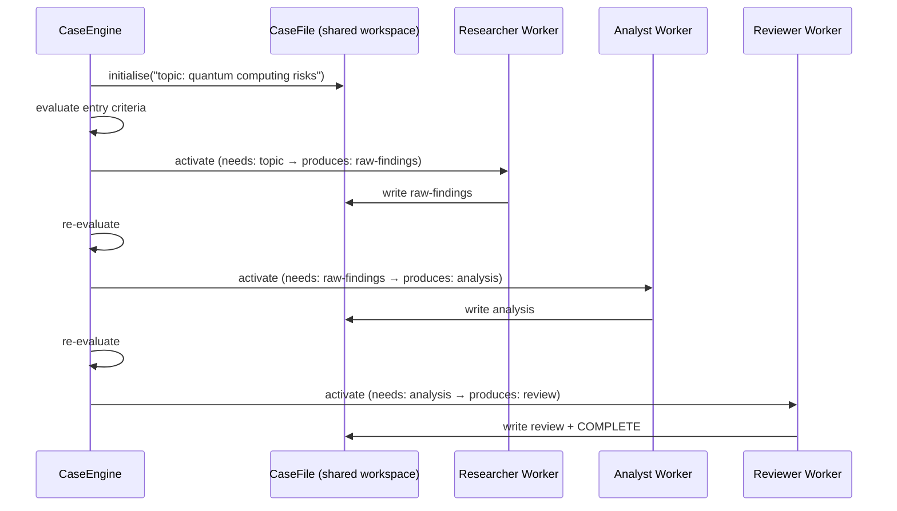

No worker knows the others exist. Each just reads what it needs and writes what it produces. The CaseEngine discovers the sequence from the declared dependencies.

### Orchestration — Light-Touch Coordination

Choreography breaks down at decision points: conflicting priorities, ambiguous routing, cases that require human judgement. Orchestration adds a coordinator — a Claude or a human — that can inject direction without micromanaging.

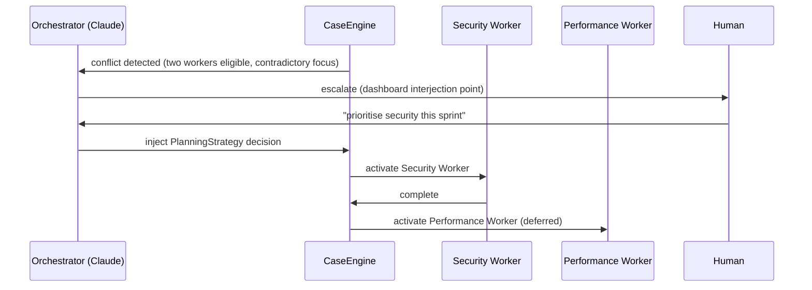

The orchestrator doesn't replace choreography — it resolves the cases choreography can't handle. Most of the time, workers self-organise. The orchestrator is the exception handler.

### The Lineage System — The Substrate for Learning

Every goal a worker records, every transition between workers, every task result — captured with full provenance. This is not logging. This is **structured memory of how multi-agent work actually unfolds**.

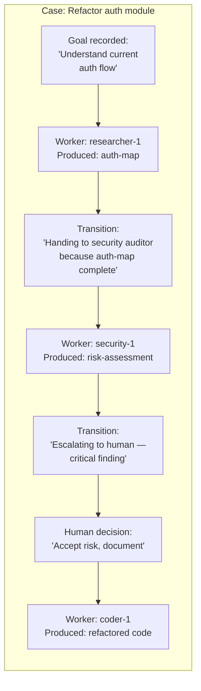

Over time, these lineage graphs become the training data for the system's own planning strategies: *for auth-related cases, the optimal sequence is researcher → security auditor → human checkpoint → coder, with a transition average of 4 minutes*.

### CaseHub SPI — Extension Points

CaseHub defines clean interfaces that external systems implement. This is how CaseHub reaches into Claudony and Qhorus without depending on them.

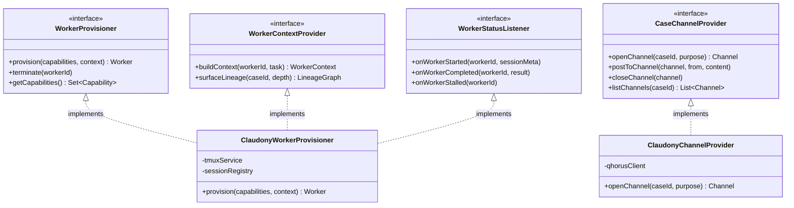

### Worker Provisioner Extensibility

Because provisioning is an SPI, the same CaseHub instance supports radically different deployment topologies:

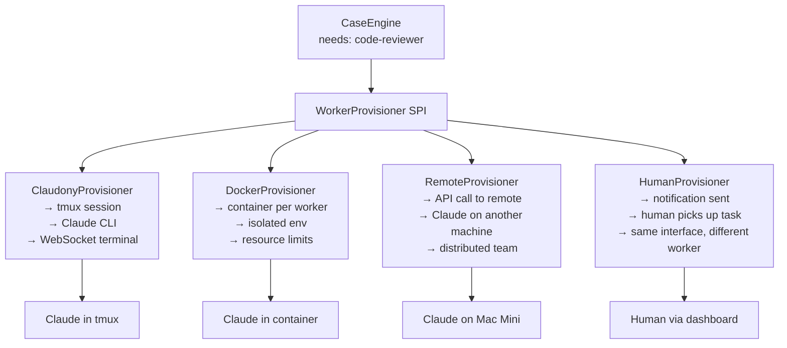

A Docker provisioner gives you isolated, reproducible, resource-bounded Claude workers — each case gets a clean environment with no cross-contamination. A remote provisioner distributes work across machines. A human provisioner makes humans first-class workers in the same coordination system.

---

## Qhorus — The Agent Communication Mesh

Qhorus is the Quarkus Native port of cross-claude-mcp: a peer-to-peer agent communication layer built as a proper Quarkus embeddable library and standalone server. The name carries the concept: a **chorus** of coordinated voices, and etymologically the root of *choreography* itself — the naming coherence with CaseHub is deliberate.

### What Qhorus Provides

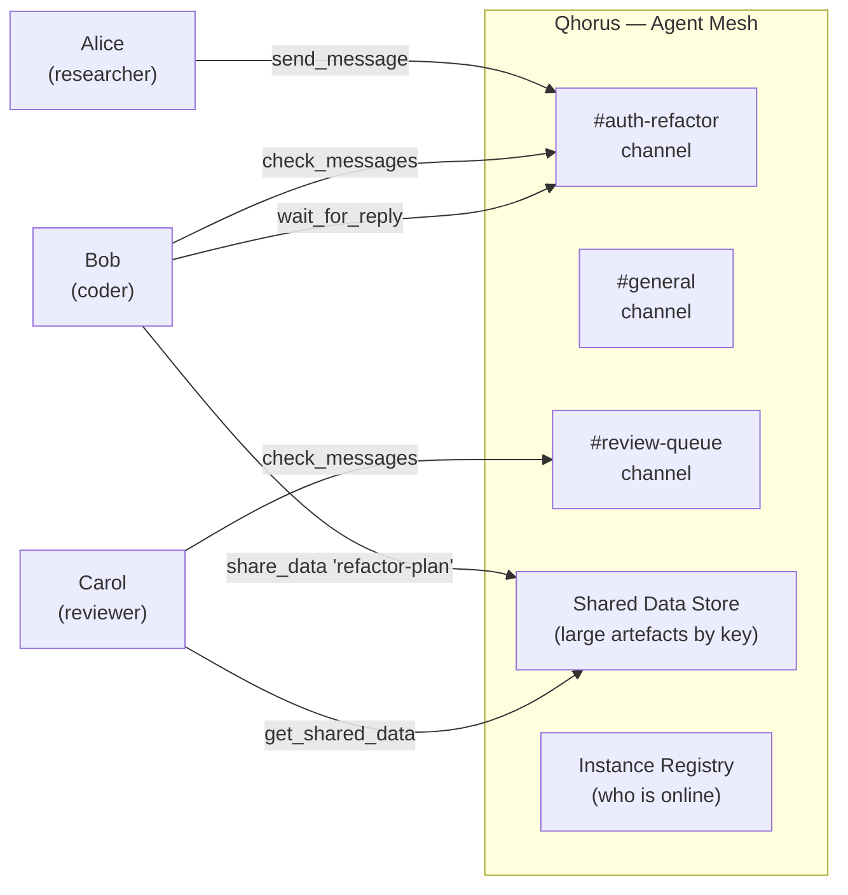

Channels are lightweight named spaces — Claudes create them as needed, find them by keyword, and communicate with typed messages: `request`, `response`, `status`, `handoff`, `done`. The `share_data` / `get_shared_data` pair handles large artefacts (analysis, plans, code) so messages stay compact.

### Qhorus MCP Tools

When embedded in Claudony or running standalone, Qhorus exposes these MCP tools to connected Claude agents:

| Tool | Purpose |
|---|---|
| `register` | Announce presence, get channel and instance context |
| `send_message` | Post to a channel (typed: request/response/status/handoff/done) |
| `check_messages` | Poll a channel for new messages |
| `wait_for_reply` | Persistent long-poll until a reply arrives or done signal received |
| `create_channel` | Open a named channel with a purpose description |
| `list_channels` | Discover all channels with activity stats |
| `find_channel` | Search channels by keyword |
| `list_instances` | See who is online |
| `share_data` | Store large artefacts by key |
| `get_shared_data` | Retrieve a stored artefact |
| `search_messages` | Full-text search across all channels |

### Qhorus and CaseHub Together

Qhorus handles the *unstructured* coordination that CaseHub's task model doesn't cover: real-time negotiation, clarification, sub-task coordination between workers. They are complementary layers.

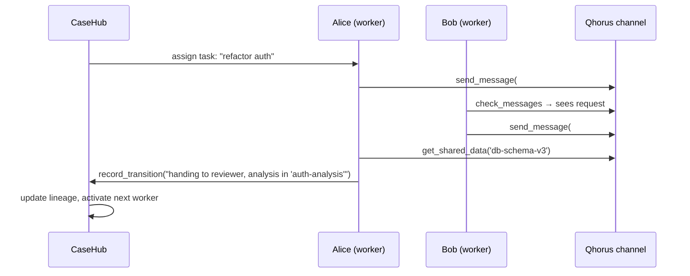

CaseHub knows the task structure. Qhorus carries the conversation within it. Lineage records reference the Qhorus channel where a transition conversation happened — so you can always trace not just *what* was produced but *how the decision was reached*.

---

## Claudony — The Integration Layer

Claudony manages Claude sessions via tmux, streams their terminals to a browser dashboard via WebSocket, and — in this ecosystem — acts as the integration layer that wires CaseHub and Qhorus together and implements all of CaseHub's SPIs.

### The Unified Dashboard

```
┌──────────────────────────────────────────────────────────────────────────┐
│  🏗️ Claudony — AI Agent Observatory                              [+New] │
├──────────────┬───────────────────────────────┬───────────────────────────┤
│  CASE GRAPH  │        TERMINAL               │       SIDE PANEL          │
│              │                               │                           │
│  [Case XYZ]  │  alice (researcher)           │  ┌─ CaseHub Task ───────┐ │
│  Auth Refact │  ┌─────────────────────────┐  │  │ Status: RUNNING      │ │
│              │  │ $ claude --mcp          │  │  │ Goal: "Map auth flow │ │
│  ● alice     │  │ > Analysing token       │  │  │  to find entry pts"  │ │
│    researcher│  │   refresh path...       │  │  │ Started: 2m ago      │ │
│  ○ bob       │  │ > Reading SessionMgr.java│  │  └─────────────────────┘ │
│    coder     │  │ > Found 3 concerns      │  │                           │
│  ○ carol     │  │   ...                   │  │  ┌─ Lineage ───────────┐ │
│    reviewer  │  └─────────────────────────┘  │  │ ← planner (done)    │ │
│              │                               │  │   "Defined scope"    │ │
│  Transitions │                               │  │ ● alice (now)        │ │
│  planner→alice│                              │  │   "Map auth flow"    │ │
│  alice→bob   │                               │  │ ○ bob (waiting)      │ │
│  bob→carol   │                               │  │   "Implement fixes"  │ │
│              │                               │  └─────────────────────┘ │
│              │                               │                           │
│              │                               │  ┌─ #auth-refactor ────┐ │
│              │                               │  │ alice: Starting      │ │
│              │                               │  │   analysis...        │ │
│              │                               │  │ bob: Schema in       │ │
│              │                               │  │   shared-data        │ │
│              │                               │  │ alice: Got it, tnx   │ │
│              │                               │  │                      │ │
│              │                               │  │ ┌──────────────────┐ │ │
│              │                               │  │ │ 💬 [You]: please │ │ │
│              │                               │  │ │ prioritise token  │ │ │
│              │                               │  │ │ refresh first     │ │ │
│              │                               │  │ └──────────────────┘ │ │
│              │                               │  └─────────────────────┘ │
└──────────────┴───────────────────────────────┴───────────────────────────┘
```

Three panels, unified:

- **Left** — the CaseHub task graph: active case, worker assignments, transitions, lifecycle states
- **Centre** — the live terminal for the selected worker (xterm.js, WebSocket streaming)
- **Right** — the side panel: current CaseHub task state, goal, lineage history, and the Qhorus channel conversation for this case — with a human interjection input at the bottom

### Human-in-the-Loop Interjection

The interjection input in the side panel is not cosmetic. A human typing there:

1. Posts to the Qhorus channel as a `human` sender — visible to all workers in that channel
2. Optionally pauses the CaseHub case (suspends the CaseEngine control loop)
3. Workers see the message on their next `check_messages` or `wait_for_reply` cycle
4. The human decision is recorded in the lineage — with full provenance — as a first-class event

This makes humans **first-class participants in the choreography**, not external overseers.

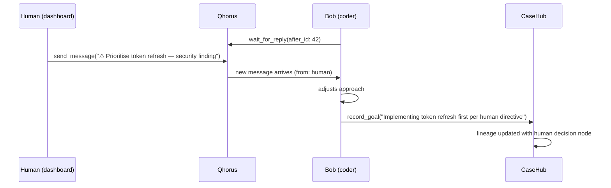

### Claudony as SPI Implementor

Claudony implements all four of CaseHub's SPIs using its own infrastructure and Qhorus:

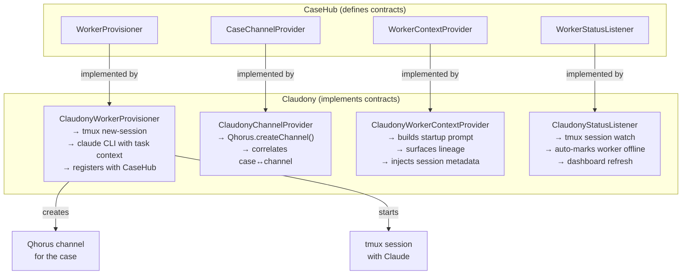

### What Claudony Automates

When a Claudony-managed Claude session starts, Claudony automatically:

1. Calls `register_worker` in CaseHub with capabilities inferred from session configuration
2. Creates a Qhorus channel for the assigned case (if one doesn't exist)
3. Injects the startup context into the Claude's initial prompt: task, lineage, channel name, prior worker summaries
4. Monitors the session lifecycle — on tmux session exit, automatically marks the worker offline in CaseHub

The Claude still makes **semantic MCP calls** itself — `record_goal`, `record_transition`, `complete_task` — because only the Claude knows its intent. Claudony handles the bookkeeping; the Claude handles the meaning.

---

## MCP Surfaces — The Full Picture

Three distinct MCP endpoints, each serving a different audience:

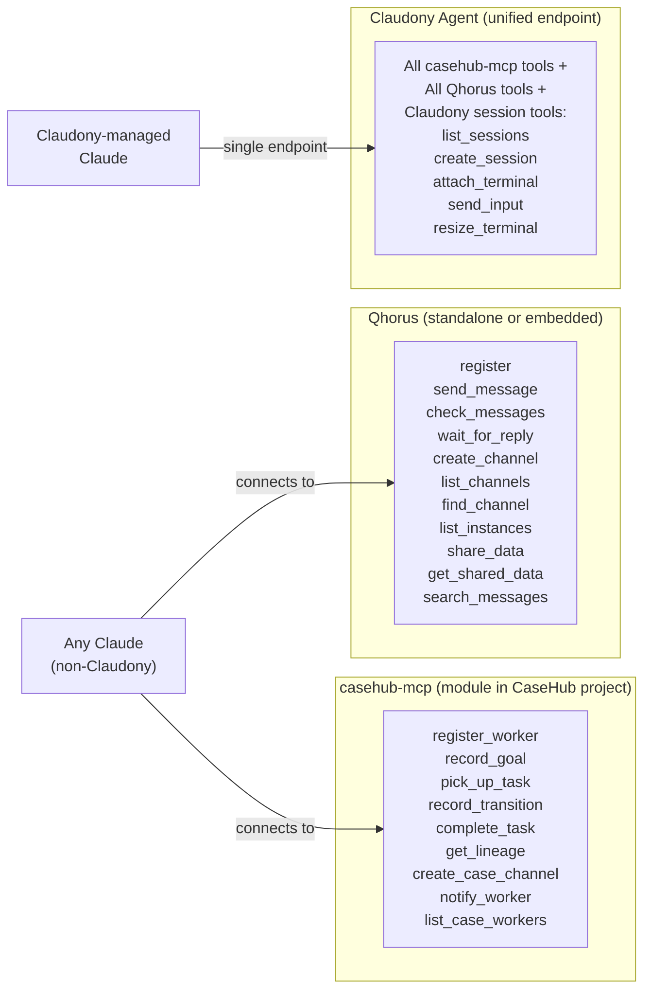

**Any Claude** — not managed by Claudony — connects to `casehub-mcp` and/or Qhorus directly. It gets the full worker and communication capability, without terminal observation or automatic lifecycle management.

**A Claudony-managed Claude** connects to a single unified MCP endpoint and gets everything: CaseHub worker tools, Qhorus communication tools, and session management tools — plus Claudony automating the bookkeeping behind the scenes.

### casehub-mcp Tool Reference

| Tool | Description |
|---|---|
| `register_worker` | Declare capabilities, current goals, optional `claudony_session_id` |
| `record_goal` | Capture mid-task intent: what you're doing, why, what you expect to produce |
| `pick_up_task` | Accept work — response includes full lineage of prior workers on this case |
| `record_transition` | Before handing off: who to, what you produced, why you're transitioning |
| `complete_task` | Report result and outcome quality |
| `get_lineage` | Pull the full worker history for a case on demand |
| `create_case_channel` | Open a Qhorus channel for a case (flows through CaseChannelProvider SPI) |
| `notify_worker` | Send a message to a specific worker's channel |
| `list_case_workers` | See all workers assigned to a case and their current status |

---

## The Lineage Data Model — Building Toward Self-Model Learning

The lineage system is the long-term value of the ecosystem. Every interaction is captured:

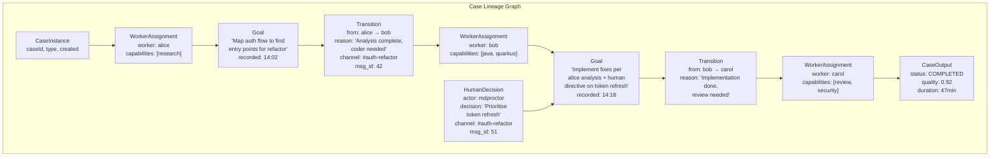

### System-Level Learning (Phase 1 — Build Now)

The lineage graph accumulates. CaseHub's `PlanningStrategy` reads historical lineage and begins to bias decisions:

- *For auth-related cases, researcher → security → coder outperforms researcher → coder → security by 34% on quality scores*
- *Bob consistently produces higher quality when preceded by alice's analysis*
- *Human decisions at the security-checkpoint reduce downstream rework by 60%*

These patterns inform future case planning without changing the core choreography model.

### Claude Self-Model Learning (Phase 2 — Build Toward)

When a Claude calls `pick_up_task`, the response surfaces relevant lineage:

```json
{
  "task": "refactor auth module",
  "lineage": {
    "prior_workers": [
      {
        "worker": "alice",
        "goal": "Map auth flow to find entry points",
        "produced": "auth-analysis (shared-data key)",
        "duration": "12 minutes",
        "quality": 0.88
      }
    ],
    "transitions": [
      {
        "reason": "Analysis complete, coder needed",
        "channel": "#auth-refactor",
        "human_decisions": ["Prioritise token refresh"]
      }
    ],
    "pattern_hint": "For auth cases, security review before merge increased quality 34%"
  }
}
```

The Claude reads this context and self-adjusts: *I know what alice produced. I know the human's directive. I know the pattern hint suggests I should flag for security review when done.* It records a more informed goal. Its transition reasoning improves. Over time, workers that receive richer lineage produce better outcomes — which generates richer lineage for the next worker.

This is the flywheel: **better instrumentation → richer lineage → smarter context → better outcomes → better instrumentation**.

---

## Deployment Topology

### Phase B — Start in Claudony (Single Binary)

Everything in one Quarkus Native binary. CaseHub embedded, Qhorus embedded, unified dashboard. Fast to build, immediate value.

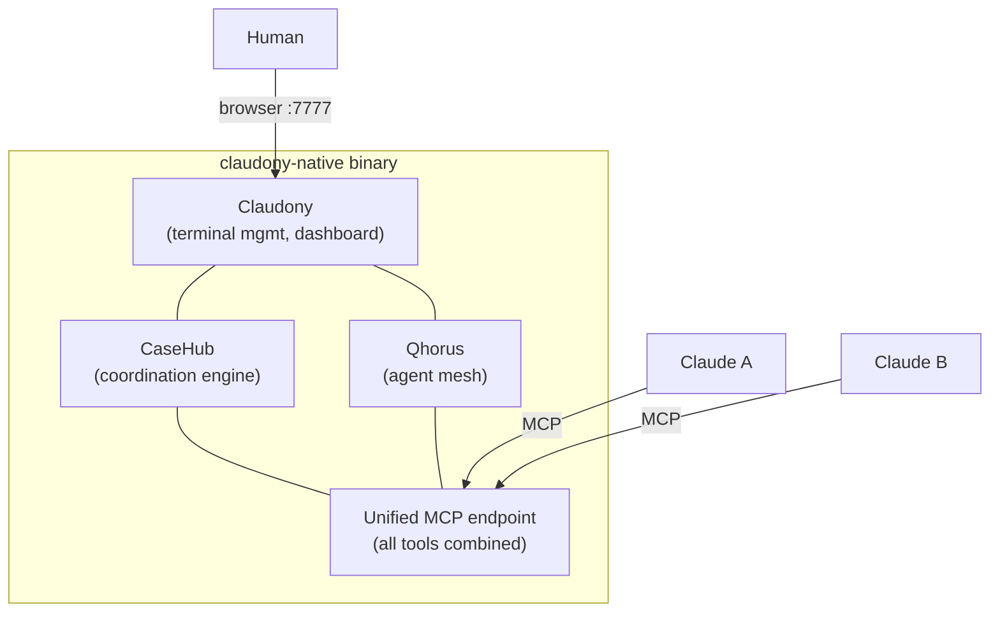

### Phase C — Protocol Discipline (Clean API)

While building in B, the MCP tool API is designed as if standalone. `claudony_session_id` is optional everywhere. No Claudony internals leak into the tool signatures. The protocol is ready to extract.

### Phase A — Any Claude, Anywhere

`casehub-mcp` extracted to the CaseHub project. Qhorus runs standalone. Claudony-managed Claudes get the enhanced experience; any other Claude connects to the standalone endpoints.

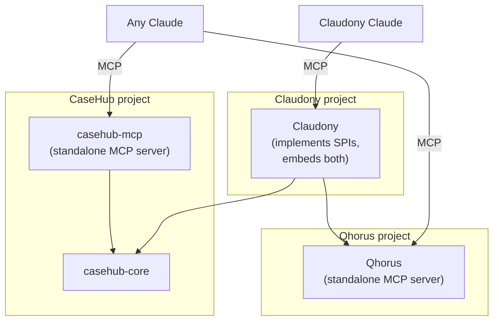

---

## Use Cases

### 1. Autonomous Code Review Pipeline

A Claude instance detects a PR is open. It registers as a `planner` worker in CaseHub, creates a case with `type: code-review`, and the choreography engine activates workers in sequence: `researcher` (reads the diff), `security-auditor` (checks for vulnerabilities), `test-generator` (writes missing tests), `reviewer` (synthesises findings). Each worker records goals and transitions. The human sees the entire pipeline in the Claudony dashboard — terminals streaming in real time, conversation in the side panel — and can inject a comment mid-pipeline. CaseHub records the human decision as a first-class lineage node.

### 2. Elastic Research Team

A user asks for deep research on a topic. CaseHub creates a case and the `WorkerProvisioner` spins up five Claude workers in parallel — two researchers, one fact-checker, one synthesiser, one editor. Workers use Qhorus channels to share partial findings (via `share_data`) and coordinate handoffs (via `send_message`). CaseHub's choreography engine gates the synthesiser until both researchers are done. The human watches five terminals and five channel conversations simultaneously, stepping in to refocus a researcher that has gone down a rabbit hole.

### 3. Docker-Isolated Security Audit

A sensitive codebase needs auditing. The `DockerProvisioner` is registered. CaseHub provisions each worker in its own isolated container — no shared filesystem, resource bounded, destroyed after the task completes. The Claudony dashboard observes container health alongside terminal output. The lineage records container metadata (image, resource usage) alongside the semantic work. No Claude worker touches the codebase outside its container.

### 4. Human-as-Worker

A case reaches a decision point that requires a human domain expert. CaseHub's `HumanProvisioner` sends a notification. The human opens the Claudony dashboard, sees the case context and full lineage, and accepts the task — now *they* are a worker in the choreography. They record a goal ("reviewing legal implications"), make a decision, record a transition ("approved with conditions — see shared-data: 'legal-sign-off'"). CaseHub continues. The human and Claude workers are indistinguishable from the coordination engine's perspective.

### 5. Distributed Team, Distributed Claudes

An engineering team works across machines. Each developer runs Claudony locally. A central CaseHub instance (on a Mac Mini) coordinates work. A `RemoteProvisioner` dispatches tasks to Claude workers on different machines. Qhorus channels carry coordination. The team lead watches the unified dashboard — all workers, all terminals, all conversations — on their own machine. The lineage accumulates across the whole team's work.

---

## Why Quarkus Native

The Quarkus Native choice is not about startup time or raw throughput — the workload is I/O bound and Node.js handles that fine. The choice is about **ecosystem composability**.

- **Single binary** — one native executable, no JVM, deploys anywhere, runs on a Mac Mini at 30MB resident
- **Quarkus extensions** — each component can be packaged as a proper Quarkus extension, added to any Quarkus AI application as a dependency
- **CDI and SPI** — Quarkus's dependency injection makes the SPI pattern (WorkerProvisioner, CaseChannelProvider) clean and testable
- **Panache** — the same ORM layer across all three components; one database, one migration tool
- **GraalVM reflection config** — once solved for the ecosystem, shared across all components
- **quarkus-mcp-server** — the Quarkiverse MCP Server extension handles all protocol boilerplate; tools are just annotated Java methods

As the ecosystem grows — more provisioners, more planning strategies, more channel providers — each new component is a Quarkus module that drops in. The platform compounds.

---

## Dependency Graph Summary

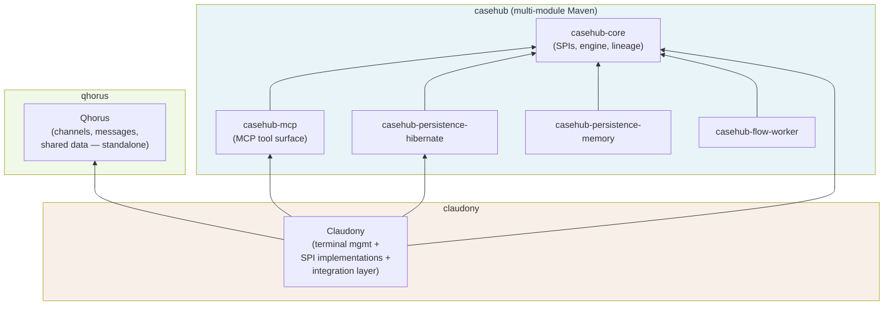

**Key constraints:**
- `casehub-core` has no dependency on Claudony or Qhorus
- `qhorus` has no dependency on CaseHub or Claudony
- `claudony` depends on both — it is the integration layer, not a foundation
- `casehub-mcp` depends only on `casehub-core` and the Quarkus MCP Server extension — fully extractable

> *Note: this graph shows the Phase A end-state. In Phase B, the casehub-mcp tools are implemented inline inside Claudony's Agent MCP endpoint rather than as a separate module. Extraction to a standalone `casehub-mcp` module happens in Phase A.*

---

## Roadmap

| Phase | What | Value |
|---|---|---|
| **B — Now** | Qhorus port to Quarkus, CaseHub SPIs, embed both in Claudony | Single binary, unified dashboard, basic lineage capture |
| **B — Continued** | casehub-mcp tools, human interjection, goal/transition recording | Claudes are first-class workers with structured coordination |
| **C — Protocol** | Clean MCP API with no Claudony coupling, optional `claudony_session_id` everywhere | Protocol is extractable, any Claude can connect |
| **A — Extract** | casehub-mcp as standalone module, Qhorus standalone server | Non-Claudony Claudes participate, ecosystem broadens |
| **Beyond** | DockerProvisioner, RemoteProvisioner, HumanProvisioner | Elastic, distributed, mixed human-AI teams |
| **Learning** | PlanningStrategy reads lineage history, pattern hints in `pick_up_task` | System gets smarter with every case |
| **Self-model** | Claude receives rich lineage context, adjusts self-declared capabilities | Agents become autonomous participants in their own improvement |

---

*This document is the architectural foundation for the Quarkus Native AI Agent Ecosystem. It feeds the DESIGN.md of each project and will serve as the basis for public communication about the platform's direction.*
